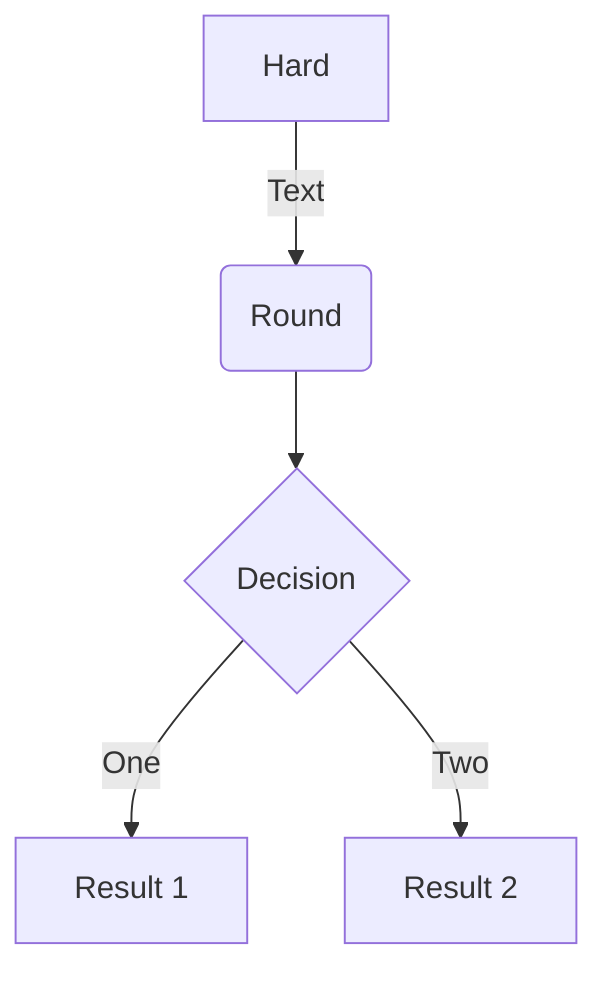
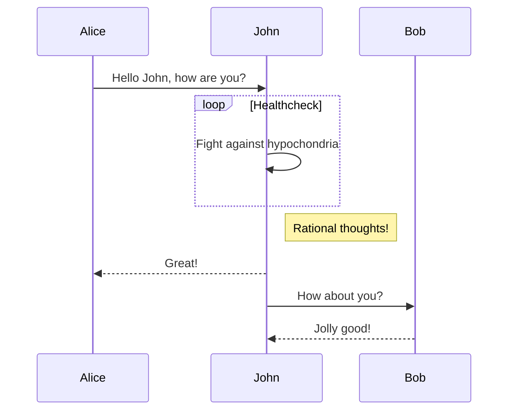
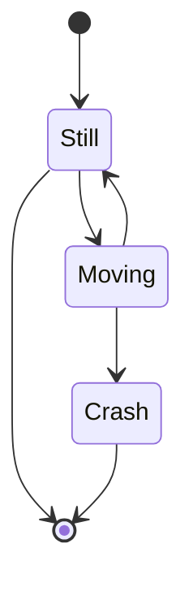
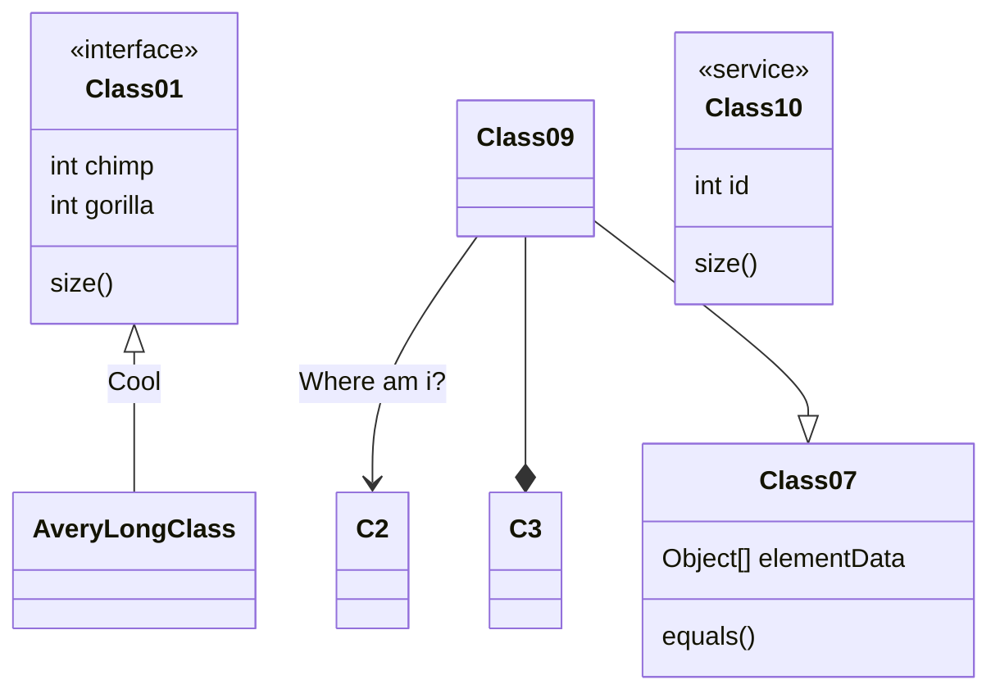
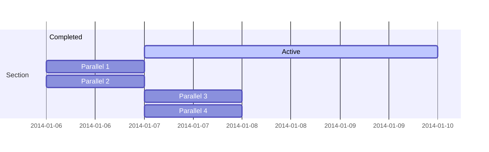

## 前言

实习一个多月，终于要开始根据需求开发功能了

组长安排下来任务，让我们先写功能设计文档，再开始 Coding

这，写功能，不是拿起键盘就 Coding？？？！！！

不过写到一半，发现思路混乱（自己太菜），只好放下 Pycharm 中没有写完的代码，开始补开发文档

于是一边用 Typora 码字，一边用 Draw.io 画流程图、顺序图... ...(痛苦面具

好在 Typora 支持 美人鱼（Mermaid），官方仓库连接在下方😀

- [Mermaid Github](https://github.com/mermaid-js/mermaid)

## 好的文档为什么需要画图🙃

一图胜千言，适量的文字加上合适图表，可以实现 `1+1 > 2`的效果

引用官网的话

> "Diagramming and Documentation costs precious developer time and gets outdated quickly. 
>
> But not having diagrams or docs ruins productivity and hurts organizational learning."

> 绘制图表和文档花费了宝贵的开发人员时间，并且很快就过时了。 
>
> 但是没有图表或文档会极度拖慢生产效率并团队之间的交流学习造成不利影响。

1. 很快过时的原因是，绘图软件通常导出的文件是图片；

   软件开发过程中，在旧功能上做了修改

   更新对应文档的时候，想要编辑当中的图片就不是这么容易了。

2. 没有图表和文档，又是万万不能的

   作为一名新人，深知看图还是比纯文字文档省力

   好的开发文档中的图标，能够帮助理解抽象的功能实现，以及业务流程

   

## Meimaid 可以画哪些图？

如图所示

当然不止这些，可以去官网文档详细了解，相信一定不会枯燥的！😏

### 举例

- 流程图

- 顺序图

- 状态图

- 类图

- 实体关系图(实验阶段)

- 甘特图

上面这些图表，不用拖拽图片，睁大眼睛去微调

只用在支持 Mermaid 的编辑器环境中，编写几行 Mermaid 代码就可以自动绘制

如果熟悉 Markdown 语法，上手会很快

具体可以去[Mermaid官网文档](https://mermaid-js.github.io/mermaid/#/)学习~

## 写在最后

掌握了 Mermaid 的语法，结合支持 Markdown & Mermaid 的文本编辑器

作为开发人员编写开发文档

不用操心图片有没有对齐、线的粗细合不合适等（这些都是以后完善文档再去微调的事情😫

最少可以缩短三分之二用在绘图软件画图的时间

---

不过有一说一，毕竟 Mermaid 还在发展和完善中，无法满足更加细化的绘图需求

Mermaid 适合快速实现流程图、顺序图等场景

所以追求完美图表，而且时间充裕的人来说，还是应该考虑专业的绘图工具

