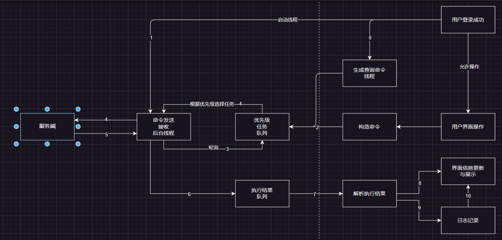
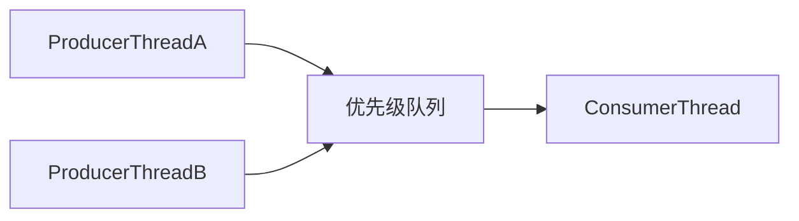

## 前言

最近在用 Pyside2 写机器人的上位机项目时，遇到了一个需要用到优先级队列的场景

> **服务端**的情况特殊，只能维持一个长连接，监听一个 TCP 活动端口，因此一次只能响应一个命令请求
>
> 所以“**客户端**”这边，只能有一个线程去和“**服务端通信**”

因此根据设备的情况，和业务的需要，设计了如下的程序框架：



那么，优先级队列，怎么发挥他的作用呢？

##  优先级队列

简单介绍一下 python 中优先级队列

> `PriorityQueue`是Python标准库`queue`模块中的一个类，它实现了一个优先队列。
>
> 优先队列中的每个元素都有一个优先级，优先级最高（数值最小）的元素最先出队。

在Python中，我们可以使用`PriorityQueue`类的`put()`方法添加元素，使用`get()`方法获取并删除优先级最高的元素。

以下是一个简单的例子：

```python
#!/usr/bin/python3
# -*- coding:utf-8 -*-
from queue import PriorityQueue

# 创建一个优先队列
pq = PriorityQueue()

# 添加元素，每个元素都是一个元组，第一个元素是优先级，第二个元素是数据
pq.put((2, 'code'))
pq.put((1, 'eat'))
pq.put((3, 'sleep'))

# 获取并打印出优先级最高的元素
while not pq.empty():
    print(pq.get())
```

在这个例子中，`'eat'`有最高的优先级（1），所以它会被最先打印出来。

```bash
>>> (1, 'eat')
>>> (2, 'code')
>>> (3, 'sleep')
```


## 用起来吧！

数字的大小，代表这个对象的，在队列中，被取出时的优先级，越小越优先（VIP）

数字可以是**浮点数**，例如：`0.5`、`1`、`1.5`...

-  `ProducerThreadA ` 类模拟不断产生，优先级较低的，”查询命令“的线程
- `ProducerThreadB` 类模拟不断产生，优先级高的”控制命令“的线程
- `ConsumerThread` 类模拟”服务端“，不断处理来自，客户端的命令




```python
#!/usr/bin/python3
# -*- coding:utf-8 -*-
from queue import PriorityQueue
import threading
import random
import time

# 模拟不断产生查询命令的线程
class ProducerThreadA(threading.Thread):
    """生产者线程A，不断地向队列中添加优先级为3的命令'C'"""
    def __init__(self, queue):
        super().__init__()
        self.queue = queue

    def run(self):
        while True:
            self.queue.put((3, 'C'))
            time.sleep(1)

# 模拟用户的操作线程，随机产生优先级高于查询的“控制”命令
class ProducerThreadB(threading.Thread):
    """生产者线程B，随机地向队列中添加优先级为1的命令'A'和优先级为2的命令'B'"""
    def __init__(self, queue):
        super().__init__()
        self.queue = queue

    def run(self):
        while True:
            if random.randint(0, 1) == 0:
                self.queue.put((1, 'A'))
            else:
                self.queue.put((2, 'B'))
            time.sleep(random.randint(1, 3))

class ConsumerThread(threading.Thread):
    """消费者线程，不断地从队列中获取命令并执行"""
    def __init__(self, queue):
        super().__init__()
        self.queue = queue

    def run(self):
        while True:
            # 打印出当前的队列元素
            print(f'队列中的命令：{self.queue.queue}')
            priority, cmd = self.queue.get()
            print(f'执行命令 {cmd}，优先级为 {priority}')
            self.queue.task_done()

# 创建一个优先级队列
pq = PriorityQueue()

# 创建并启动生产者线程和消费者线程
producerA = ProducerThreadA(pq)
producerB = ProducerThreadB(pq)
consumer = ConsumerThread(pq)

producerA.start()
producerB.start()
consumer.start()
```

运行代码，效果如下：

```python
>>> 队列中的命令：[(2, 'B'), (3, 'C')]
>>> 执行命令 B，优先级为 2
>>> 队列中的命令：[(3, 'C')]
>>> 执行命令 C，优先级为 3
...
```

## 可能存在的问题

优先级的队列机制也不是万能的

如果服务端，出现异常，或者没能及时处理完队列中的命令

所以，上面的代码，是可能会导致客户端内存的不断增加的！

因此需要限制队列的大小，以及生产者的发送能力，尽量避免无法控制的情况发生

修改一下刚刚的代码：

```python
... skip ...
# 修改生产者 A 代码
class ProducerThreadA(threading.Thread):
    """生产者线程A，不断地向队列中添加优先级为3的命令'C'"""
	while True:
	    self.queue.put((3, 'C'), block=True)
    	time.sleep(1)
        
# 修改生产者 B 代码
class ProducerThreadB(threading.Thread):
    """生产者线程B，随机地向队列中添加优先级为1的命令'A'和优先级为2的命令'B'"""
   ...skip...
    def run(self):
        while True:
            if random.randint(0, 1) == 0:
                self.queue.put((1, 'A'), block)
            else:
                self.queue.put((2, 'B'), block)
            time.sleep(random.randint(1, 3))
            
# 修改优先队列的大小
pq = PriorityQueue(maxsize=10)
...skip...

```

运行一下，看看队列中命令，是否被控制在 10 个之内~

```python
队列中的命令：[(1, 'A'), (3, 'C'), (3, 'C')]
执行命令 A，优先级为 1
队列中的命令：[(2, 'B'), (2, 'B'), (3, 'C'), (3, 'C'), (3, 'C'), (3, 'C'), (3, 'C')]
执行命令 B，优先级为 2
队列中的命令：[(2, 'B'), (2, 'B'), (3, 'C'), (3, 'C'), (3, 'C'), (3, 'C'), (3, 'C'), (3, 'C')]
执行命令 B，优先级为 2
队列中的命令：[(2, 'B'), (3, 'C'), (3, 'C'), (3, 'C'), (3, 'C'), (3, 'C'), (3, 'C'), (3, 'C')]
执行命令 B，优先级为 2
队列中的命令：[(2, 'B'), (3, 'C'), (3, 'C'), (3, 'C'), (3, 'C'), (3, 'C'), (3, 'C'), (3, 'C'), (3, 'C'), (3, 'C')]
执行命令 B，优先级为 2
队列中的命令：[(3, 'C'), (3, 'C'), (3, 'C'), (3, 'C'), (3, 'C'), (3, 'C'), (3, 'C'), (3, 'C'), (3, 'C'), (3, 'C')]
执行命令 C，优先级为 3
队列中的命令：[(2, 'B'), (3, 'C'), (3, 'C'), (3, 'C'), (3, 'C'), (3, 'C'), (3, 'C'), (3, 'C'), (3, 'C'), (3, 'C')]
...
```

好了，可以暂时歇会了）

**怎么处理返回的命令呢？返回的命令如何赋予优先级呢？**

不管了，明天再说吧。


